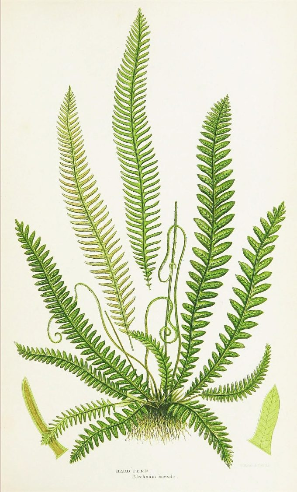

[Queering Earth](https://queering.earth/)

Colophon

# How this site is made

Queering Earth is drawn as a herbarium sheet in daylight: warm paper, dark ink, a few saturated accents, and specimens laid out the way a Victorian plate lays them out. This page says what that means, what the colours and the type are, and what we mean by the handful of words the site uses for its own parts.

## The model: a Victorian specimen sheet

A herbarium is a collection of pressed plants. Each specimen is mounted on a sheet of paper, and beside it goes a **label** — what the thing is, who collected it, where, and when. The label is not decoration. It is the entire scientific value of the object: an unlabelled specimen is a dead plant, and a labelled one is evidence.

Nineteenth-century botanical books took that arrangement and made it beautiful. A plate from one of them is a page with a specimen drawn large, the parts of it laid out around the edges, and a caption in small engraved capitals along the bottom. Foxed cream paper, dark line work, one or two saturated colours doing all the work.

We build pages that way because it matches what the site actually does. Every piece here mounts somebody else's work and writes a label for it. Getting the label right — whose words these are, which edition, which year — is the whole job, exactly as it is in a herbarium.

## Biophilic, and what that means here

[Biophilic design](https://en.wikipedia.org/wiki/Biophilic_design) is the practice of building environments that keep people in contact with living things and the patterns of living things — daylight, growth, organic form, natural materials — on the argument that human attention is calibrated for them and does badly without them.

On a website that cannot mean real plants, so it means the parts that survive translation:

- **Daylight, not a void.** The ground is warm paper. Our sibling site [Star Stuff](https://starstuff.earth/) is a night sky; this is deliberately the other end of the day.
- **Growth, not twinkle.** The drawings draw themselves on — stems first, then leaves opening. Nothing pulses, flashes, or shimmers.
- **Organic geometry.** Curves, tapers, and things that lean. The type deviates on purpose.
- **Motion you can decline.** All of it sits inside `prefers-reduced-motion: no-preference`, so a reader who has asked for stillness gets the *finished* drawing, never a missing one.

## The words this site uses

Five of them, borrowed from the herbarium and meant literally.

**Specimen**
: The thing being read, and it is somebody else's: Woolf's essay, a painting, a myth, a word. A specimen is collected, not written. On the page it is the quotation in its ruled box.

**Sheet**
: One page of this site — the paper the specimen is mounted on, and everything we say about it. [The Army of the Upright](https://queering.earth/on-being-ill) is a sheet.

**Label**
: The small ruled block near the top of a sheet: subject, maker, the date of the original, the date of the reading, and who read it. **The label is where we speak.** Their words are in the specimen; ours are on the label; the line between the two is drawn in the layout rather than left to a reader's good faith.

**Plate**
: Two meanings, both in use. In a book, a plate is a full-page illustration — the borrowed botanical images below are plates. On this site, [the front page](https://queering.earth/) is *the* plate: the sheet on which the others are mounted and numbered.

**Card**
: How a sheet appears on the plate — kind, accession number, title, and a line about it. The coloured tape across the top of each card is the only thing distinguishing one from another at a glance.

One more, not yet in use: a **run** is a sequence of sheets sharing a lens. There is no run yet, and there will not be one until three sheets want the same shelf.

## The palette

Every colour on the site is a token in one stylesheet, and no page writes a hex. That is not tidiness. Star Stuff once shipped forty-four of forty-six pages that *printed blank*, because they hardcoded colours the print sheet could not reach.

The house style asks for a contrast ratio of **7:1**, not the usual 4.5:1. Three tokens clear it against the ground and are allowed to carry text. The rest are decoration — line art, rules, the tape on a card — and are never set as type.

The chips below are drawn with the tokens themselves rather than with copies of them, so they show *the ground you are reading in*. Switch grounds with the control at the top of the page and this list restates itself.

- PaperThe ground. `--qe-paper`
- CardBoxes and labels. `--qe-card`
- InkBody text — 14.3:1 on paper. `--qe-ink`
- MossHeadings, secondary — 7.8:1 on paper. `--qe-moss`
- RustLinks and emphasis — 7.0:1 on paper. `--qe-rust`
- LichenDecoration only. `--qe-lichen`
- VerdigrisDecoration only. `--qe-verdigris`
- MarigoldDecoration only. `--qe-marigold`
- CoralDecoration only. `--qe-coral`
- VioletDecoration only. `--qe-violet`
- LilacDecoration only. `--qe-lilac`
- Lilac, paleDecoration only — the wash under the lilac. `--qe-lilac-pale`

The seven decorative colours are the ones a butterfly wing gives you. They are used sparingly and never all at once. The two lilacs arrived last and arrived together, borrowed for [the moth on the home page](https://queering.earth/#queering-is-a-verb): a wash and the thing washed onto it cannot be one value, which is the same reason `--qe-paper` has a `--qe-paper-deep`.

## The two grounds

The sheet has a **daylight** ground and a **cabinet** ground, and the cabinet is not the daylight sheet with the lamp switched off. It is the drawer shut: a herbarium cabinet is dark warm brown, and a Victorian dark-ground plate prints its specimens on near-black precisely so that pale forms read. The accents on this site were always the accents of such a plate — sage foliage, marigold leaves, coral caps, cream bodies — which is the argument for brown and against a dark green. Green ground shares its hue with moss, lichen, and verdigris, and takes the separation out of the colours the site is built from.

Two numbers move and the rest do not. Ink, moss, and rust are lifted to clear 7:1 on the new ground — **12.8:1**, **7.2:1**, and **7.3:1** respectively. The seven decorative tokens stay where they are, still saturated. **7:1 is a rule for letters.** Applying it to the drawings turns every flower chalky and washes the plates out; the brightness belongs to the text.

One inversion is worth naming, because it is a trap rather than a taste. In daylight a card is *lighter* than the page, so text sitting on one gains contrast. On a dark ground that instinct is backwards — a lifted card *loses* it, and solving for 7:1 on a lifted panel drags rust up into a pale pink with no rust left in it. The cabinet's cards are recessed instead, which keeps every token above target and reads better anyway: compartments in a drawer.

**Paper is always daylight.** Both ground switches are screen-only, so a reader in the cabinet who hits Print gets ink on white — the print sheet builds its own black-on-white from scratch and never inherits a ground.

## Wabi-sabi, and which parts of it we can actually claim

[Wabi-sabi](https://en.wikipedia.org/wiki/Wabi-sabi) is a Japanese aesthetic that finds beauty in the imperfect, the incomplete, and the impermanent — the chipped bowl, the weathered post, the thing visibly made by hand and visibly used. It reached English-language design writing largely through Leonard Koren’s *Wabi-Sabi for Artists, Designers, Poets & Philosophers* (1994), and it has been circulating in web-design advice ever since.

This site was not designed from it. A herbarium sheet is *already* most of it — foxed paper, a specimen that has faded, a hand-lettered label, a mount that has been handled — so when we went looking, six of the seven principles usually cited turned out to be here already, and nobody had aimed at any of them. One of the six was here in name only. The seventh was missing outright. That is worth saying plainly rather than claiming a lineage: **we found the vocabulary after the fact, and it told us the two we had been getting wrong.**

What we cannot vouch for, in the thing we are borrowing

- **The seven are not wabi-sabi’s.** The list circulating as “the seven principles of wabi-sabi” is Hisamatsu Shin’ichi’s **seven characteristics of Zen art**, from *Zen and the Fine Arts* (Kodansha International, 1971). Zen aesthetics and wabi-sabi overlap and are not the same thing, and the relabelling happened somewhere in transmission, not in Hisamatsu.
- **We have not read the book.** We have the seven at one remove, from a peer-reviewed paper that cites it (Lomas et al., 2017). A secondary source that says it is quoting is still a secondary source, so nothing below is offered as Hisamatsu’s wording.
- **The third one — the one about age — is exactly where the transmission frays.** Renderings disagree on what it is even called: *koko* in the paper we have it from, *shibui* in other renderings, both glossed as austere or weathered or dry. We use *koko* and cannot settle it from here.
- **And in the design advice, its age has gone.** The version that prompted this glosses its third principle as quiet, unobtrusive beauty that reveals depth over time — a definition with *nothing weathered in it at all*. Whatever the term should be, **the aging got sanded off on the way to the design blogs**, which is why “patina” keeps recurring in the advice without ever resolving into a principle. That is this site’s own subject: a concept tightened in transmission, with the attribution left attached.

With that stated, here is the honest scoring — what the sheet does, and where it was weak.

**Fukinsei · asymmetry**
: **The strongest, and not by accident.** This is the one principle that *is* the site’s argument rather than its decoration: the display face carries an axis called `WONK` and it is turned up, the slips lean at an angle stated per slip, and the four sprigs on the front page are each drawn for their own corner rather than mirrored into place — because a mirrored corner hangs its flowers upside down. A site about deviating from a norm does not get to be symmetrical.

**Kanso · simplicity**
: Two shared files, no build step, extensionless addresses, and a register that is all on the page at first paint rather than folded into accordions. The pressure here is component count, not file size: the sheet defines about twenty named pieces, and that is the number to watch.

**Koko · the weathered one**
: **The one we had nothing for.** Every alternative we tried was a picture of age painted over the words. What we landed on instead is in the next section but one: age as a *record* — every sheet says how often it has been corrected, and links to the entries. It is the only kind of patina that cannot be faked, and it is the reason this section exists.

**Shizen · naturalness**
: Four soft stains under everything, no image and no grain, in positions that differ on every sheet. It was worse until recently: the stains were pinned to the window rather than to the paper, so they held still while the sheet scrolled past them, and all nine sheets were foxed in identically the same four places.

**Yūgen · subtle profundity**
: Present in the writing and **deliberately absent from the visuals**. Room left open for the reader is this site’s design brief, and every sheet carries a panel of what it will not resolve. But nothing here is dimly perceived or revealed on scroll: *yūgen* earned by depth of reading is real, and yūgen manufactured by withholding is a loading state wearing a borrowed name.

**Datsuzoku · freedom from convention**
: A changelog that is an accession register, a dark mode that is a drawer shut rather than a lamp switched off, corrections filed as ordinary entries instead of buried in a commit log. Renderings also gloss this one as freedom from *attachment*, which is a different and harder idea, and we are not claiming it.

**Seijaku · tranquility**
: **The weakest, and it was a measurable defect rather than a mood.** Fifteen components shared one surface, so nothing could be ranked by looking at it, and the stylesheet used twenty-five unrelated margin values. Quiet is not an atmosphere you add; it is what is left when the page stops repeating itself. Both are the subject of the next section.

**One thing this vocabulary does not license.** The usual advice for making a page feel handmade is a grain image or a noise tile, and the reason we refuse it is in the next section but one: a texture is invisible to the tool that measures whether text is readable. **An aesthetic borrowed for its warmth is not permission to make words harder to read.** Imperfection on this site is always in the paper, the rules, and the drawings — never in the letters, and never in the contrast.

## The three surfaces

Fifteen components on this site once shared one treatment — the card colour, a hairline box, the same corner radius on all four corners — so somebody else’s words, our own commentary, and a note about how the register is kept were **the same object to look at**. That is a fault in hierarchy rather than a matter of taste: a reader could only rank them by reading the label.

**Bare**
: Space, and nothing else. **This is where we speak**, and it is the default: our own commentary does not need a frame to be ours, because a sheet says whose words are whose in words.

**Ruled**
: The card colour inside a hairline box. **Something is mounted here** — a quotation, a plate, the mounting label, a restored attribution. If it is ruled, somebody handed it to us.

**Ruled off**
: Hairlines above and below, and no fill at all. The ledger’s own housekeeping: how this page is kept, and what a sheet has not resolved. Ruled off and *dashed* means provisional.

The third one is rules rather than a tint, and that is a measurement. A recessed panel was tried first, in the ground one step deeper than the paper, and in daylight it drops moss to **6.90:1** and rust to **6.21:1** — both under the house 7:1, and both over the 4.5:1 the guard gates at. It would have passed silently. Hairlines cost nothing, and every token keeps the number it was chosen for.

Space is a scale for the same kind of reason. One line of body text is about 1.96rem, and every gap between blocks is a whole number of quarter-lines of it. The type on this site leans, wobbles, and refuses to sit on the line, and **none of that reads as deviation without a norm to deviate from** — twenty-five unrelated margin values read as noise and flatten the deviations that were meant. Inside a block, the hand is still allowed.

And a panel takes one of three corner profiles, none of them square and no two alike, spread so that no two panels you see together are cornered the same way. **A sheet handled a hundred times does not have four identical corners.** It is a radius, so it costs nothing in contrast and nothing on paper.

## Age, and where the gold goes

The foot of every sheet says when it was mounted, and how often its label has been corrected or its determination changed since, with each clause linked to the entry in [the register](https://queering.earth/changelog) that did it. That is this site’s idea of patina: **age as a record rather than a texture**. It is true, you can check it, it accrues on its own as the register grows, and it survives plain view, paper, a screen reader, and 400% zoom, because it is a sentence.

**Texture never goes under text.** The usual advice for making a page feel like paper is a grain image or a noise tile, and it is refused here: a texture varies the effective background luminance from pixel to pixel, and the guard that measures this site composites text against computed colours — it cannot see a texture at all. Grain under body text would pass every check here and fail a real reader. The foxing on this page is four soft stains painted under everything, at a token’s alpha, in four positions that are different on every sheet.

A sheet that has been corrected is ruled off in **marigold** rather than in the house hairline, and the register spends the same marigold on a re-determination. That is the one borrowed idea here: [kintsugi](https://en.wikipedia.org/wiki/Kintsugi) is not that the crack shows — it is that **the most precious material in the workshop is spent on the break**. On a site whose whole risk is a wrong attribution, the gold belongs on *we got this wrong and fixed it* and not on the day a sheet went up. The colour is on the rule and never on the letters, and **a seam requires a repair that is actually in the register**: a gold join on a sheet nobody ever corrected would be decoration asserting a fact.

**We did not get to kintsugi first, and the people who did are the ones we work with.** Stimpunks Foundation ran [a whole session on it in May 2026](https://stimpunks.org/2026/05/06/infodumplings-kintsugi-and-finding-the-gold-within-you/), four months before any of this reached a stylesheet, and their framing is the one that matters: “The cracks are where the gold goes.” Their thesis is not about pottery — it is stated on that page as “we are not broken. We are kintsugi.” Spiky profiles fracture where others do not; the survivorship is the gold; and “Kintsugi doesn’t restore the original object. It makes something that couldn’t have existed without the break.” Read that page before this one. Ours is the small version: a stylesheet doing what they were already saying.

And it names the reason this belongs on *this* site rather than being imported warmth. Their line is “Masking is the opposite of Kintsugi.” A site about queering normativity — about the cost of passing for typical — cannot then tidy away its own repairs and file its mistakes where only the maintainers can read them. **A hidden correction is a masked one.** That is the argument for an accession register a reader can reach, and it arrived from Stimpunks rather than from a design blog.

## The type

Two families, both variable, both with real fallback stacks. **[Fraunces](https://fonts.google.com/specimen/Fraunces)** sets the display, and it was chosen for one reason: it carries an axis called `WONK`, which exposes letterforms that deviate from the norm as a setting you can turn up. A site about queering normativity setting its masthead with the deviation axis open is the argument made in the type rather than described in prose.

Fraunces italic — wonk and soft, turned up

jasmine, gypsywort

The same face and the same words, axes at zero

jasmine, gypsywort

Look at the descenders. With the axis open, the *g* ends in a hook that does not close; with it shut, the same *g* curls into a tidy loop. The *j* and the *y* change with it. Most of the alphabet does not move at all — the deviation is small, and it is applied exactly where deviation is possible.

You are in plain view, so both lines above are set in your own reading face and the two settings are identical. That is plain view working, not a fault — the decoration is what got switched off.

Newsreader — the reading face

Considering how common illness is, how tremendous the spiritual change that it brings, how astonishing, when the lights of health go down, the undiscovered countries that are then disclosed.

**[Newsreader](https://fonts.google.com/specimen/Newsreader)** sets everything you actually read: body text at about 19px, line spacing 1.65, and a measure of roughly 66 characters. Body text on this site never goes below 18px and must survive 200% zoom.

## Plain view

Every page has a **plain view** control at the top. It turns off the wonk, the rotation, the display faces, the paper wash, and the motion, and leaves the words exactly as they are.

It is a stylesheet, not a second document. There is one copy of every sentence on this site, and the decoration is a layer over ordinary semantic HTML. **Never an image of text; never a decorative copy and an accessible copy.** Two copies of the same words drift, and the accessible one is always the copy that rots.

## The drawings

The botanical art at the top of each page is inline SVG — paths in the page, coloured by the same tokens as everything else, animated in CSS. Nothing is an image file, so it stays sharp at any size, prints as line work, and costs no extra request.

Motion is growth: stems draw themselves in, then leaves and wings unfurl. All of it is gated behind `prefers-reduced-motion`, so the reduced state is the completed drawing.

One drawing is neither at the top of a page nor a plant. At the foot of [Queering is a verb](https://queering.earth/#queering-is-a-verb) there is a moth with the Earth where its body should be — an homage to the cover of Nick Walker’s *Neuroqueer Heresies*, which sets a human brain there, drawn in Ezra Furman’s lilac and black. It wears the same classes as the botanical art, so it inherits that motion rather than restating it, and its coastlines are **projected rather than drawn**: three passes of hand-drawn continents read as an inkblot and, at the centre of that particular drawing, as a brain — which is the one thing it must not be mistaken for.

## Borrowed plates

Where a page wants a real botanical illustration rather than our line work, it uses a **public domain** plate from a nineteenth-century book, most of them digitised by the [Biodiversity Heritage Library](https://www.biodiversitylibrary.org/), whose scans of out-of-copyright natural history are one of the quiet gifts of the open web.

Hard Fern, *Blechnum boreale*. [*The ferns of Great Britain, and their allies the club-mosses, pepperworts, and horsetails*](https://www.biodiversitylibrary.org/page/38460846) (London: Society for Promoting Christian Knowledge, 1855). Public domain.

Plate 511, [*The Floral Magazine*, volume 9](https://www.biodiversitylibrary.org/page/50241086) (London: L. Reeve & Co., 1870). Drawn and lithographed by Worthington G. Smith. Public domain.

Two rules govern them, and the second one has teeth.

**Public domain, verified, not assumed.** The Biodiversity Heritage Library hosts material under several different rights statements, and plenty of it is *not* public domain. A fern plate we nearly used here was marked “some rights reserved” and was put back.

**Read the corner, not the catalogue.** A plate carries its own attribution, engraved in the margin by the person who made it, and the catalogue record is a finding aid that can be wrong. A Curtis’s plate we considered is tagged *Walter Wood Fitch* in its record; the signature on the plate reads *W. Fitch*, and the artist was Walter Hood Fitch. The orchid above is credited from the words engraved at the bottom of the plate itself. The fern is credited to its book and no further, because the record names no artist and the signature is too faint to read in the scan — and a name we cannot read is not a name we will print.

## Who reads, and who writes

A sheet has a label rather than a byline, and the difference is the point. **Maker** is whoever made the specimen — Woolf, Rossetti, Helen Edgar. **Read by** is whoever did the reading and is answerable for what the sheet says about it. Those are two different people on two different rows, and no sheet collapses them into one name at the top.

The reading, the editing, and the deciding are Helen Edgar’s and Ryan Boren’s. The drafting is done in sessions with [Claude](https://claude.com/claude-code), directed and edited by whoever is named on the *Read by* row. Nothing reaches a page unread: every quotation on this site is checked against a primary source by a person, and logged with the date it was checked in the [attribution ledger](https://github.com/Stimpunks/Queering-Earth/blob/main/ATTRIBUTIONS.md), which is public for the same reason this page is.

A tool does not get a row on the label, because a byline is responsibility and a tool cannot carry any. **But saying so here rather than nowhere is the same rule the ledger runs on.** The risk this site carries is a wrong attribution, and a site that keeps a ledger of everyone else’s words owes an honest account of where its own came from.

## How it is built

Static HTML files with no build step, one shared stylesheet, and a few small scripts that check the things we have got wrong before: markup that browsers silently rewrite, pages missing from the sitemap, and contrast measured on screen *and* under print emulation. Everything here is [on GitHub](https://github.com/Stimpunks/Queering-Earth).
