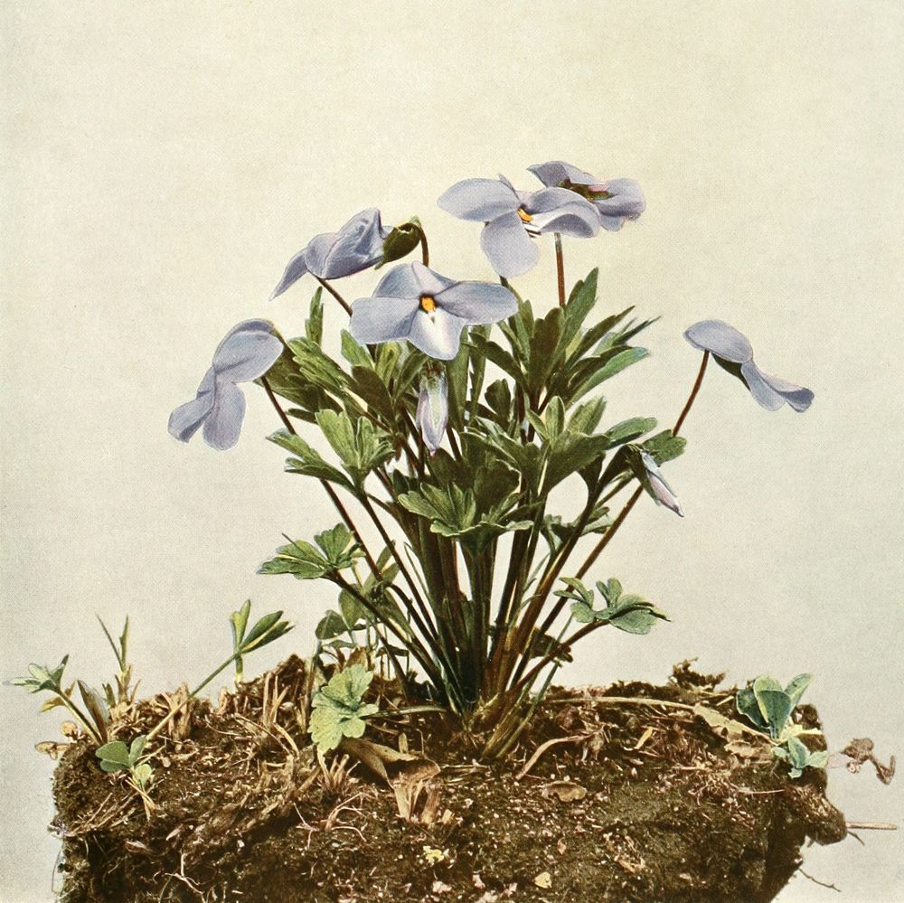
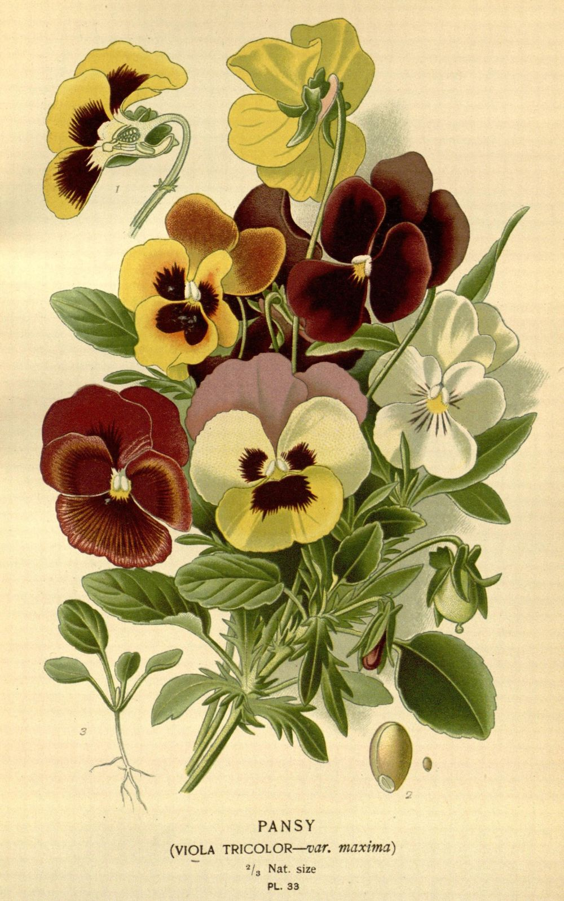
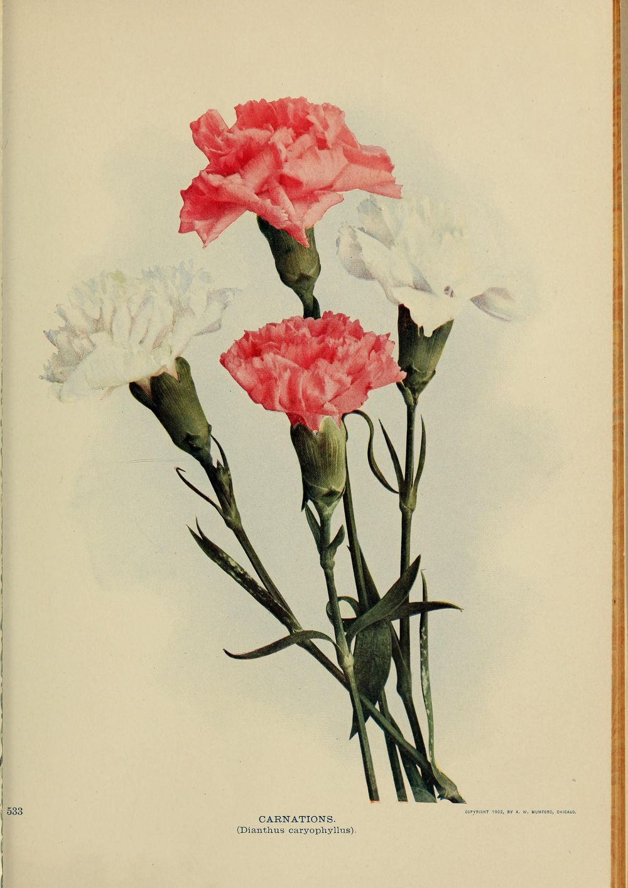
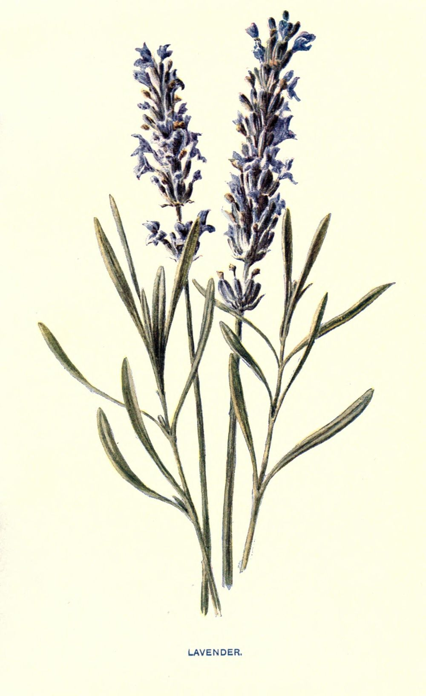

1. [Queering Earth](https://queering.earth/)
2. [The plate](https://queering.earth/the-plate)

Sheet · a reading

# A Waste Garden, Flowering at Its Will

Violet, pansy, green carnation, and lavender were worn where they could be seen. Each was read in the end by the people it was meant to slip past, and each was picked up again afterwards by the people it had been used against.

A code you wear is a code you do not control. The whole point of a flower in a buttonhole is that it passes: it is legible to the people it is for and invisible to everyone else, and it costs nothing to put down. That is its strength for exactly as long as it lasts, and it never lasts.

These four went the same way, in the same order, a century apart from each other. A word or an object gets picked up because it is safe. It stops being safe. It becomes the name for the thing it was hiding — not a description any more but a charge, something a newspaper can print and a court can enter into evidence. And then, later, sometimes much later, the people it was used against pick it up again on purpose and wear it in the open, which is the only move left once the secret is gone.

**The flower does not change.** What changes is who is holding the meaning, and on this evidence it changes hands at least twice.

## Somebody else gathered these four

The set is not ours. Violet, pansy, green carnation, and lavender are assembled as a group by Sarah Prager in [*Four Flowering Plants That Have Been Decidedly Queered*](https://daily.jstor.org/four-flowering-plants-decidedly-queered/), JSTOR Daily, 29 January 2020, and this sheet exists because that piece put them on one table. Go and read it: it carries a good deal that is not here, including the violets sent on stage in *The Captive* in 1926, George Chauncey’s pansy craze, the Lavender Scare, and the Lavender Menace action of 1970.

**What is hers is the gathering. What is ours is the reading** — that these four are one process caught at four different moments, and that the process runs the same way each time. And one other thing is ours, further down, and it is a correction.

What this sheet quotes, and what it does not

Every quotation below was read in the work it comes from and is logged in the site’s [attribution ledger](https://queering.earth/ledger) with the date and the copy. Where a claim belongs to a scholar and we have not read the primary, the claim is named as theirs and not repeated as ours. **There is more history here than this sheet asserts**, and the gap is deliberate.

## The violet, which was a description before it was a code

Birdfoot violet, *Viola pedata*, from Homer D. House, *Wild Flowers of New York* (University of the State of New York, Albany, 1918), photographed by Walter B. Starr and Harold H. Snyder. **This is not Sappho’s violet.** It is an American species, photographed for a state museum survey twenty-five centuries later, and it is on this page because a public-domain plate of the right violet was not to hand. The plant is the genus, not the poem.

The oldest of the four is the one that was never a code to begin with. Sappho’s violets are just violets — worn, plaited, remembered — and what makes them the root of a symbol is that somebody else described her that way and the description stuck.

Specimen — the epithet

> Violet-weaving, pure, soft-smiling Sappho, I want to say something, but shame prevents me…

Alcaeus, addressing Sappho, in Henry Thornton Wharton, *Sappho: Memoir, Text, Selected Renderings and a Literal Translation* (London, 1885). Wharton notes that the Greek epithet is ἰόπλοκος — violet-weaving — and that some manuscripts read ἰοπλόκαμος, *with violet locks*. The two readings are a hair apart and mean different things: one is what she does, the other is what she looks like.

Wharton, annotating a different fragment about girls plaiting garlands, records the ancient commentary matter-of-factly: “that plaiting wreaths was a sign of being in love.” That is the whole mechanism, six centuries before the common era. A thing women did with flowers was understood to mean something, by people who were not being coy about it, and it did not need to be a signal because nothing yet required it to be concealed.

**A code is what a description becomes when the description gets you into trouble.** Nothing about the violet changed between Sappho’s island and a Broadway theatre in 1926. What changed is that by 1926 it had to be a code.

## The pansy, which became the word

Pansy, *Viola tricolor* var. *maxima*, Plate 33 of Edward Step, *Favourite Flowers of Garden and Greenhouse* (Frederick Warne, 1896), plates selected and arranged by D. Bois. Digitised by the Biodiversity Heritage Library. The same genus as the violet above, bred up into a face.

The pansy is the violet’s garden cousin and it had the shortest journey of the four, because it did not stay an object. It became a word, and the word is still in use as an insult in a way that *violet* and *lavender* never quite managed.

The etymology is worth a moment, because it is the joke the language played. *Pansy* is the English of the Old French pensée — “thought, remembrance” — from penser, to think, and it arrives in English in the middle of the fifteenth century as *pense*, the flower “regarded as a symbol of thought or remembrance”. Something under five centuries later the same word is [recorded by 1929](https://www.etymonline.com/word/pansy) in its other sense, and the insult keeps the shape of the flower’s own meaning: **the charge is not what he does, it is what he is understood to have in mind.**

The 1920s and 1930s American drag scene that took the flower’s name is not ours to summarise. The historian George Chauncey is the source Prager cites for the *pansy craze*, and his *Gay New York* is where that account lives. We have not read it, so we are pointing at it rather than reporting it.

## The green carnation, which no plate can show

Carnations, *Dianthus caryophyllus*, from *Birds and Nature* (A. W. Mumford, Chicago, 1902), page 533; digitised from the Smithsonian Institution Libraries’ copy. **These are the wrong colour and there is no right one.** A green carnation is a white carnation stood in dye. No botanical plate of the flower Wilde’s friends wore exists, because the flower they wore does not grow — which is a fair description of the code itself.

Prager writes that “the green carnation became a queer symbol in 1892 when Oscar Wilde instructed a handful of his friends to wear them on their lapels to the opening night of his comedy *Lady Windermere’s Fan*.” We have not read that back to a primary and do not assert it here as our own. What we have read is the poem, and the transcript of the morning the poem was read out in court.

Lord Alfred Douglas published *Two Loves* in *The Chameleon* in December 1894. It opens in a garden, and the garden is full of the flowers this sheet is about.

Specimen — the garden

> I dreamed I stood upon a little hill,\
> And at my feet there lay a ground, that seemed\
> Like a waste garden, flowering at its will\
> With buds and blossoms. There were pools that dreamed\
> Black and unruffled; there were white lilies\
> A few, and crocuses, and violets\
> Purple or pale, snake-like fritillaries\
> Scarce seen for the rank grass…

Lord Alfred Douglas, *Two Loves*, first published in *The Chameleon*, December 1894. The poem ends: “I am the Love that dare not speak its name.”

**The violets are already in the poem.** Douglas is not building a code; he is describing a garden that grows what it likes, and the phrase this sheet takes its title from says so plainly — *a waste garden, flowering at its will*. Waste, in 1894, means uncultivated. Nobody arranged it. Nobody is coming to weed it.

Four months later the poem was uncultivated ground no longer. At the Old Bailey in April 1895, prosecuting counsel put the last line to Wilde as a question, and the reply is on the record in the shorthand reports.

Specimen — the same line, in court

> **Mr. Gill.** — “I daresay! There is another sonnet. What construction can be put on the line, ‘I am the love that dare not speak its name’?”

> **Witness.** — “I think the writer’s meaning is quite unambiguous. The love he alluded to was that between an elder and younger man, as between David and Jonathan; such love as Plato made the basis of his philosophy; such as was sung in the sonnets of Shakespeare and Michael Angelo; that deep spiritual affection that was as pure as it was perfect…”

*The Trial of Oscar Wilde: From the Shorthand Reports* (Paris, privately printed, 1906), pages 58–59. **His answer runs on past where we stop it**, through two more sentences about Michelangelo and Shakespeare, and the ellipsis marks that rather than any cut inside what is quoted. The report adds that Wilde spoke “with great emphasis and some signs of emotion”, and that the gallery answered with “a medley of applause and hisses” which the judge ordered suppressed.

Two small things in that exchange are worth keeping. Gill calls it a sonnet, and it is not one — *Two Loves* runs to seventy-odd lines. And the line as spoken in court reads *the love*, lower case, where the poem has *the Love*, a capitalised figure who has just given his name. The court flattened a character into a category, which is precisely what the trial did to the man in the box.

That is the turn, and it took under five months. In December the flowers are in a poem. By April the poem is an exhibit, and the buttonhole that had been a private joke among friends is a thing the newspapers can describe.

## The lavender, and the man the sentence is actually about

Lavender, *Lavandula*, Plate 10 of *Familiar Garden Flowers*, figured by F. Edward Hulme and described by Shirley Hibberd, first series with coloured plates, 1907. Digitised by the Biodiversity Heritage Library.

One sentence carries most of the weight of lavender’s reputation, and it is quoted constantly. Prager quotes it: “One of the most notable uses of ‘lavender’ comes from the historian Carl Sandburg, who wrote in 1926 of Abraham Lincoln: ‘A streak of lavender ran through him; he had spots soft as May violets.’”

**The words are Sandburg’s, exactly. The *him* is not Lincoln.** Here is the paragraph the sentence comes from, which opens Chapter 54 on page 265 of the first volume.

Specimen — the whole paragraph

> Joshua Speed was a deep-chested man of large sockets, with broad measurement between the ears. A streak of lavender ran through him; he had spots soft as May violets. And he and Abraham Lincoln told each other their secrets about women. Lincoln too had tough physical shanks and large sockets, also a streak of lavender, and spots soft as May violets.

Carl Sandburg, *Abraham Lincoln: The Prairie Years*, volume 1 (Harcourt, Brace, 1926), page 265. Read in two independently digitised copies: the University of British Columbia Library’s copy, scanned at the University of Toronto, and an Internet Archive copy scanned at Cebu. On page 266 Sandburg says it a third time, of both of them at once — “had given these two men streaks of lavender, spots soft as May violets.”

So the celebrated sentence describes Joshua Speed, and Sandburg extends it to Lincoln in the next sentence but one, in different words, and then to the pair of them on the following page. **The substance of the claim survives the correction entirely.** Sandburg did write that of Lincoln. He did not write *that sentence* of Lincoln.

This is not a gotcha and we are not offering it as one. Prager names Speed herself in her very next sentence, and her book is partly about him; she plainly knows whose paragraph this is. What happened to the quotation is compression — the line got attached to the more famous of the two men on its way through a hundred retellings, and it arrives looking like a sentence about Lincoln because everybody has met it as one.

**That is this site’s own failure mode, and it is why we noticed.** The risk here is never an invented source; it is a true quotation whose object has quietly moved. Nothing was fabricated, no word was altered, and the citation is still correct at the level of book and author and year. Only the referent slipped, and the referent is the whole meaning: a sentence about two men in one bed in Springfield is a different sentence from a sentence about a president.

It is also, read the other way, a small demonstration of the thing this sheet is about. A phrase that meant one man is now doing service for another, because a code in circulation belongs to whoever is circulating it.

## The garden does not stay uncultivated

Line up the four and the shape is the same every time, only the interval changes.

-

violet

description → code

Plaited into garlands with nothing to hide, and still a plain description in Wharton’s notes in 1885. A signal only once there was something to signal past.

-

pansy

code → slur

The only one of the four that stopped being an object and became a word. Named for a thought, and used to name a man by what he is presumed to be thinking.

-

carnation

code → evidence

A flower that had to be dyed to mean anything, worn for two years and then read out in a courtroom. Nothing in nature to point at, which was the point.

-

lavender

code → scare → banner

The one that has been all the way round: a soft word in 1926, a purge in the 1950s, an insult meant to frighten a movement in 1969, and a slogan printed on a shirt in 1970.

The last of those is the only one of the four with a documented moment of somebody taking it back on purpose, and it belongs to the women who wore the shirts. That history is Prager’s to tell in her piece and the historians’ to tell in theirs; we have not read it to a primary and so we do not tell it here.

What we will say is the pattern, because the pattern is the reading. **A code fails by succeeding.** It works until enough people are using it, and the number of people who make it useful is the same number who make it legible from the outside. Then it is not a code any more, it is a name, and the name is in somebody else’s mouth.

And then the last move, the one that is not in the logic of codes at all: you keep wearing it anyway. Not because it hides you — it has stopped hiding anybody — but because a thing worn openly by enough people stops being an accusation and goes back to being a description. Which is where the violet started.

Douglas’s garden is the better image for it than any of the four flowers alone. Waste ground, growing what it likes, nobody’s scheme, “flowering at its will”. It is the most ordinary sentence in the poem and it is the only line in it nobody put on trial.

One thing we would like to fix and cannot from here

The right plate for the first section is a European sweet violet, *Viola odorata* — the violet of the Mediterranean, not the birdfoot violet of a New York state survey. The plate mounted above is the one we had, and the caption says so rather than letting the genus stand in silently for the species. **If you know of a public-domain *Viola odorata* plate**, it belongs here, and swapping it in is one line of markup and a caption. Say so in [the repository](https://github.com/Stimpunks/Queering-Earth/issues) and it will be.

Queering Earth Sheet No. 7 Accessioned 8 Sep 2026

Provenance Mounted [8 September 2026](https://queering.earth/changelog#a-2026-09-08-flowercodes). [Re-determined once](https://queering.earth/changelog#a-2026-09-08-flowercodes): the streak of lavender belongs to Joshua Speed, and only the referent moved.
